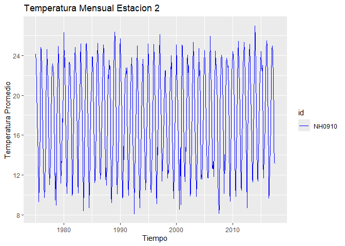

# paquetemeteorologico

<!-- badges: start -->

[](https://lifecycle.r-lib.org/articles/stages.html#experimental)
[](https://github.com/Martin-ia-pro/paquetemeteorologico/actions/workflows/R-CMD-check.yaml)
[](https://app.codecov.io/gh/Martin-ia-pro/paquetemeteorologico)
[](https://github.com/Martin-ia-pro/paquetemeteorologico/actions/workflows/check-standard.yaml)
<!-- badges: end -->

El objetivo del paquete `paquetemeteorologico` es proporcionar
herramientas para la lectura, manipulación y visualización de datos de
estaciones meteorológicas. Su proposito es facilitar el trabajo de los
profesionales de las estaciones meteorologicas. Permite descargar datos,
obtener resúmenes estadísticos clave y generar gráficos de tendencias de
temperatura mensual.

## Autores

El desarrollo y mantenimiento del `paquetemeteorologico` ha sido
realizado por:

- **Juan Martín Bongiovanni** (Autor, Mantenedor)
  - GitHub: [Martin-ia-pro](https://github.com/Martin-ia-pro)
- **Lisandro Nicolas Seghezzo Prieri** (Autor)
  - GitHub:
    [LisandroSeghezzo2003](https://github.com/LisandroSeghezzo2003)

------------------------------------------------------------------------

## Instalacion

Puedes instalar la versión de desarrollo de `paquetemeteorologico`
directamente desde GitHub usando la librería pak:

``` r
# Instalar el paquete pak (si no lo tienes)
# install.packages("pak")

pak::pak("Martin-ia-pro/paquetemeteorologico")
```

## Ejemplos

Esto es un ejemplo de código básico para usar el paquete. Mostraremos el
flujo basico del paquete que incluye descargar datos, obtener un resumen
estadistico de los datos y graficar la temperatura mensual.

Usamos `leer_estaciones()` para obtener los datos de dos estaciones.

``` r
library(paquetemeteorologico)
# Descargar los datos (usando las rutas temporales/del paquete)
estacion_1 <- leer_estaciones("NH0437", ruta_temp1)
#> El archivo no existe en la ruta indicada. Descargando...
#> Descarga completada.
#> Warning: One or more parsing issues, call `problems()` on your data frame for details,
#> e.g.:
#>   dat <- vroom(...)
#>   problems(dat)
#> Rows: 18929 Columns: 35
#> ── Column specification ────────────────────────────────────────────────────────
#> Delimiter: ","
#> chr   (2): id, direccion_viento_1000cm
#> dbl  (22): temperatura_abrigo_150cm, temperatura_abrigo_150cm_maxima, temper...
#> lgl  (10): temperatura_suelo_10cm_media, temperatura_inte_5cm, temperatura_i...
#> date  (1): fecha
#> 
#> ℹ Use `spec()` to retrieve the full column specification for this data.
#> ℹ Specify the column types or set `show_col_types = FALSE` to quiet this message.
#> Lectura completada. El dataset tiene 18929 filas y 35 columnas.
estacion_2 <- leer_estaciones("NH0910", ruta_temp2)
#> El archivo no existe en la ruta indicada. Descargando...
#> Descarga completada.
#> Rows: 15553 Columns: 35
#> ── Column specification ────────────────────────────────────────────────────────
#> Delimiter: ","
#> chr   (1): id
#> dbl   (5): temperatura_abrigo_150cm, temperatura_abrigo_150cm_maxima, temper...
#> lgl  (28): temperatura_intemperie_5cm_minima, temperatura_intemperie_50cm_mi...
#> date  (1): fecha
#> 
#> ℹ Use `spec()` to retrieve the full column specification for this data.
#> ℹ Specify the column types or set `show_col_types = FALSE` to quiet this message.
#> Lectura completada. El dataset tiene 15553 filas y 35 columnas.
```

Tambien podemos usar `tabla_resumen_temperatura()` para obtener un
resumen estadistico que calcula el máximo, mínimo, promedio y desviación
estándar de la temperatura para cada estación.

``` r
tabla_resumen_temperatura(estacion_1)
#> # A tibble: 1 × 5
#>   id       Max   Min Promedio Desvio_Estandar
#>   <chr>  <dbl> <dbl>    <dbl>           <dbl>
#> 1 NH0437  36.3   2.1     20.2            5.77
```

Posteriormente podemos utilizar la función
`graficar_temperatura_mensual()` para visualizar las tendencias de
temperatura mensual.Esta funcion genera un gráfico de líneas para
visualizar las tendencias mensuales.

``` r
graficar_temperatura_mensual(estacion_1)
#> Warning: Using `size` aesthetic for lines was deprecated in ggplot2 3.4.0.
#> ℹ Please use `linewidth` instead.
#> ℹ The deprecated feature was likely used in the paquetemeteorologico package.
#>   Please report the issue at
#>   <https://github.com/Martin-ia-pro/paquetemeteorologico/issues>.
#> This warning is displayed once every 8 hours.
#> Call `lifecycle::last_lifecycle_warnings()` to see where this warning was
#> generated.
```


``` r

graficar_temperatura_mensual(estacion_2,color = "blue", titulo = "Temperatura Mensual Estacion 2")
```


